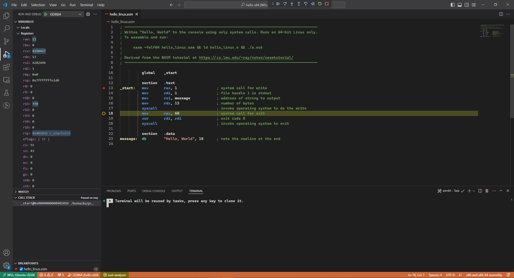
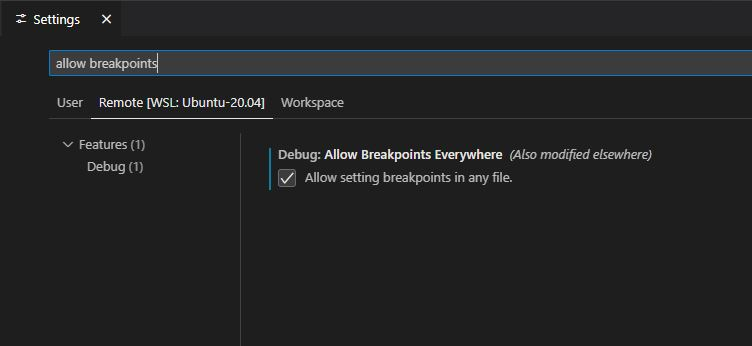

# VSCode NASM Debugging Tutorial  
  
## Visual gdb debugger with registers panel
  
  
  

## What it supports:
- x86 NASM Intel/C library
- x64 NASM Intel/C library
  
## Requirements
- VSCode 
- gdb
- [NASM Language Support](https://marketplace.visualstudio.com/items?itemName=doinkythederp.nasm-language-support) (for syntax highlighting)  
Install:  
Press `F1` inside VS code and type in: `ext install doinkythederp.nasm-language-support`
- [Native Debug](https://marketplace.visualstudio.com/items?itemName=webfreak.debug) (for visual asm debugging)  
Install:  
`F1` inside VS Code and type in:  `ext install webfreak.debug`  

## Configurations
Put [this config folder](/.vscode) into your workspace folder
- task.json: contains build task options, default is 'asm64' which is for x64 NASM Intel syntax.
- launch.json: debug options for the corresponding build task.

## Some special notes
  
Remember to build task before debugging!

### *How to add breakpoints*?  
Go to File > Preferences > Settings > Search for "Debug" and tick the AllowBreakpointsEveryWhere.
  

 
### *Where to type in your user input?*
Press `ctrl + j` and go to the "Debug Console" panel to type in your input! (shown in screenshot above).  

### *Where to watch my registers?*
Go to Variables > Registers in the Debug view.  
  
This is mainly derived from [pearldarkk](https://github.com/pearldarkk/vscode-nasm-debugging-tutorial), I've found added extensions that are actively maintained and support debugging NASM assembly.
    
Happy Assembling!
